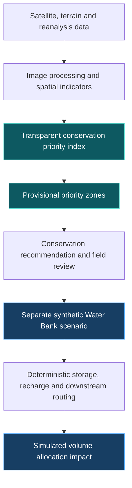

<!-- Chennai Water Bank AI | GeoImpathon 1.0 | Problem Statement 2.3 -->

<p align="center">
  
</p>
<p align="center"><sub>Concept artwork · not satellite imagery or evidence of deployed infrastructure.</sub></p>

<h1 align="center">CHENNAI WATER BANK AI</h1>
<h3 align="center">Geospatial Water Conservation Priority Mapping &amp;<br />Distributed Rainwater Intelligence</h3>

<p align="center">
  <strong>GEOIMPATHON 1.0 — Geospatial Ideas for Greener Earth</strong><br />
  Water Resource Management<br />
  <strong>Problem Statement 2.3 — Watershed-Based Water Resource Priority Mapping</strong>
</p>

<p align="center">
  
  
  
</p>

<p align="center">
  <a href="https://github.com/Janicebenita/CHENNAI_WATER_BANK_AI/actions/workflows/ci.yml"></a>
  
  
  
  
</p>

<p align="center">
  <a href="#priority-map"><strong>Explore the Priority Map</strong></a> ·
  <a href="#data-sources"><strong>Inspect the Evidence</strong></a> ·
  <a href="#run-locally"><strong>Run Locally</strong></a> ·
  <a href="https://chennai-water-bank-ai-staging-1032997828322.asia-south1.run.app/"><strong>Existing Staging Demo</strong></a>
</p>

> **Where should conservation be prioritized—and what could a Water Bank do there?**
>
> Chennai Water Bank AI connects geospatial screening with explainable rainwater-allocation engineering. Source-derived indicators identify candidate areas for investigation; the existing Water Bank engine explores local storage, modelled recharge and downstream flow under explicitly simulated conditions.

| 🌍 Spatial planning | 💧 Operational engineering |
|---|---|
| **WHERE** should water-conservation intervention be investigated? | **WHAT** could a configured node do during a rainfall event? |
| Open geospatial evidence → transparent priority index → candidate zones | Synthetic event inputs → deterministic safety gates → volume allocation |

> [!IMPORTANT]
> **Current evidence:** 12 demonstration analysis zones · 6 sourced indicators · 8 supported model inputs. Soil and drainage density are not bundled; boundaries are not official micro-watersheds. Priorities remain **provisional**, with complete-data mode available.
>
> **Deployment:** the linked staging service predates this adaptation. The new priority page is available in this repository and local runs; its Cloud Run deployment has not yet been verified.

<details>
<summary><strong>Navigate the project</strong></summary>

[Official challenge](#official-challenge) · [Problem](#problem) · [Solution](#solution) · [Workflow](#workflow) · [Data sources](#data-sources) · [Priority index](#priority-index) · [Interactive map](#priority-map) · [Recommendations](#recommendations) · [Simulation](#simulation) · [Impact](#impact) · [Responsible AI](#responsible-ai) · [ESP32](#physical-prototype) · [Architecture](#architecture) · [Run locally](#run-locally) · [Limitations](#limitations) · [Team](#team)

</details>

---

<a id="official-challenge"></a>

## 🎯 Official challenge
Identify micro-watersheds requiring water-conservation interventions using **DEM, slope, drainage density, rainfall, NDVI, land use, soil and surface-water occurrence**. Expected output: **water conservation priority zones**.

<a id="problem"></a>

## 🌧️ The problem
Conservation need and retention opportunities vary by location. Urban water management needs both a spatial screening answer — **where to investigate intervention** — and an engineering answer — **what a configured node could do during an event**.

<a id="solution"></a>

## 💡 The solution
Open **Water Conservation Priority Map**, the first numbered sidebar page, or follow the prominent Problem 2.3 link on the existing home dashboard. Inspect coloured priority zones, evidence coverage, contributing indicators and deterministic recommendations. Evaluate a separate synthetic Water Bank scenario without overwriting the existing network simulation.

**Current scope:** 12 rectangular **Demonstration Analysis Zones**, not official watersheds. Six indicators have real source-derived values. **Drainage density and soil are missing**, not fabricated. The model supports all eight via a provenance-required CSV import. Bundled results are explicitly **provisional**; complete-data mode refuses incomplete rankings. This is a working screening prototype for Problem 2.3, not a completed validated watershed delineation.

<a id="workflow"></a>

## 🛰️ Geospatial workflow

Operational event inputs remain synthetic. Annual rainfall and spatial priority are never silently converted into event rainfall, tank sizing, recharge capacity or live control signals.

<a id="data-sources"></a>

## 📡 Data sources & provenance
| Official parameter | Bundled evidence | Processing / limitation |
|---|---|---|
| DEM / elevation | Mapzen/Tilezen terrain tiles, zoom 12 | Terrarium RGB decoding; mean elevation. Source mosaic, not a certified local survey. |
| Slope | Derived from the same DEM | Gradient in metres, converted to degrees; approximately 37 m terrain pixels. Correlated with terrain. |
| Drainage density | **Missing** | Accept sourced km/km² through CSV. Hydrologically conditioned drainage extraction is a next step. |
| Rainfall | NASA POWER PRECTOTCORR, 2024 | Sum of 366 daily regional reanalysis values: 1,623.87 mm. Same regional value for all zones; not a rain-gauge measurement or local rainfall gradient. |
| NDVI | Copernicus Sentinel-2B L2A, 29 February 2024, tile 44PMV | (NIR−red)/(NIR+red); honour already-applied BOA offset. SCL classes 4/5 retain cloud-free land; at least 20% valid zonal sample coverage required. One date, not climatology. |
| Land use / cover | ESA WorldCover 2021 v200 | Modal sampled land-cover class; not parcel land use or development permission. |
| Soil | **Missing** | Accept sourced hydrologic soil group A/B/C/D through CSV; do not infer from vegetation. |
| Surface-water occurrence | EC JRC/Google GSW v1.4, 1984–2021 | Mean sampled occurrence, 0–100%; excludes nodata 255. Frequency of water presence, **not water-area percentage**. Legacy version has provider-reported inconsistencies corrected in v1.5; upgrade/validate before decisions. |

Source descriptions: [terrain service](https://www.mapzen.com/blog/terrain-tile-service/), [NASA POWER](https://power.larc.nasa.gov/docs/services/api/temporal/daily/), [Earth Search](https://github.com/Element84/earth-search), [Sentinel-2 processing](https://sentiwiki.copernicus.eu/web/s2-processing), [ESA WorldCover](https://esa-worldcover.org/en/data-access), [JRC GSW](https://global-surface-water.appspot.com/download).

[Source manifest](data/priority/manifest.json) records URLs, dates, bounding box, processing and SHA-256 hashes. [Cached source subsets](data/priority/source/) retain clipped source arrays, terrain tiles, the STAC item and rainfall response. No runtime API credentials or online analytical services are needed. The common 0.0005° grid uses nearest-neighbour samples (~54 m), not exhaustive native-resolution zonal statistics. Study extent: 80.10–80.28° E, 12.88–13.16° N.

Attribution: © ESA WorldCover project 2021 / Contains modified Copernicus Sentinel data (2021) processed by ESA WorldCover consortium. Zanaga et al. (2022), doi:10.5281/zenodo.7254221 (CC BY 4.0). Sentinel-2: Copernicus/ESA via Element 84. Terrain: Mapzen/Tilezen and contributing sources (see source service attribution). Rainfall: NASA POWER. Source: EC JRC/Google; Pekel et al. (2016), Nature 540, doi:10.1038/nature20584. Sources remain their providers’ products; this project adds demonstration analysis.

<a id="priority-index"></a>

## ⚖️ Water Conservation Priority Index
All eight starting weights are **0.125**, summing to 1: **DEMONSTRATION WEIGHTS**, not government or scientifically calibrated Chennai policy weights. Controls expose every weight and reject invalid sums.

$$
P_z = \frac{\sum_{i \in A} w_i\,n_{z,i}}{\sum_{i \in A} w_i}
$$

`A` is the same available, positively weighted indicator set across all zones. Missing values are never zero-filled. At least 50% of original weight must be available; bundled data supplies 75%. Full-data mode requires every positively weighted indicator. All eight must have positive weights to require all eight. Rankings with different weight/indicator configurations must not be compared as if calibrated alike.

Numerical normalization: clipped `(x−min)/(max−min)`, reversed where stated. Demonstration anchors: elevation 0–100 m (lower → higher priority); slope 0–15°; drainage 0–5 km/km²; annual rainfall 0–2,500 mm; NDVI −1 to 1 (lower → higher); water occurrence 0–100% (lower → higher). Higher slope/drainage/rainfall represent retention assessment need/opportunity, **not recharge suitability**. Land-cover and soil-group scoring tables are exposed in the UI and centralized with all geospatial assumptions in `src/config/settings.py`.

Classes: **Very High ≥0.8; High ≥0.6; Moderate ≥0.4; Low ≥0.2; Very Low <0.2**. Insufficient evidence is unranked. These are fixed demonstration thresholds, not quantiles engineered to force high-priority zones. Correlated indicators, mixed dates and model direction need sensitivity analysis and professional review.

<a id="priority-map"></a>

## 🗺️ Interactive priority map
| Explore | Understand | Export |
|---|---|---|
| Pan, zoom and inspect zone evidence | Review scores, classifications and indicator contributions | Download the sortable table and scored GeoJSON |

Pan, zoom and hover over georeferenced polygons. A class legend, score, slope, NDVI and surface-water evidence accompany the map. Select a zone to inspect all contributions and effective weights. Sort the complete table; download results as CSV or scored GeoJSON. OpenStreetMap supplies optional context; turning it off preserves the georeferenced interactive polygon map without external tile requests.

The optional CSV template requires every zone exactly once, all eight columns, a source declaration and period. Blank values remain missing; invalid ranges, unknown classes, duplicate zones and absent provenance are rejected. Imported declarations are marked **user-supplied, not independently verified**. Imports affect only the current session, not bundled source files.

<a id="recommendations"></a>

## 📍 From priority zones to intervention
High priority triggers investigation of distributed storage, retention capacity and candidate Water Bank placement. Moderate priority triggers targeted assessment and monitoring. Low priority supports monitoring, not a claim that conservation is unnecessary. Water/wetland/mangrove classes receive habitat-protection guidance instead of an installation recommendation.

**Recharge requires certified site testing and professional hydrogeological assessment. Field validation is required.** The scenario button evaluates the existing deterministic engine with a clearly selected synthetic scenario. Selected geography is planning context only; it does not imply an installed device or approved site.

<a id="simulation"></a>

## ⚙️ Deterministic Water Bank simulation

**STORE · RECHARGE · STORE_AND_RECHARGE · DIVERT · CONTROLLED_DISCHARGE**

The six original simulated demonstration locations are **Adyar, Anna Nagar, Perungudi, T. Nagar, Tambaram and Velachery**. They are separate from the 12 geospatial analysis zones and do not represent deployed municipal assets.

All existing pages remain: Command Center, Node Intelligence, Scenario Lab, Network Simulation, Impact Analytics, Decision Explainer, Solution Architecture, About the Solution and Physical Process. The safety-first engine and `SensorDataSource` boundary remain intact. No changes to allocation, runoff, recharge, storage, simulator or persistence implementations were needed.

Unsafe and first-flush water cannot directly recharge. Allocation remains capacity-constrained, nonnegative and mass-balanced. Memory mode and Firestore fallback remain available. The six original demonstration nodes remain simulated.

<a id="impact"></a>

## 📊 Impact Analytics
The existing demonstrated full network event retains its values:

| Metric | Simulated event value |
|---|---:|
| Calculated runoff | 1,036,747 L |
| Stored locally | 279,123 L |
| Routed toward modelled recharge | 9,490 L |
| Immediate downstream flow | 748,134 L |
| Retained from immediate downstream flow | 288,612 L |
| Simulated event runoff retained | approximately 27.8% |

> **Approximately 27.8% of this demonstrated simulated event runoff is retained from immediate downstream flow.**
>
> This is a volume-allocation estimate, not a hydraulic flood-depth or damage model.

These are **simulated volume-allocation estimates**, not municipal observations, measured groundwater recharge, flood-depth changes or damage reduction. Independently rounded displayed totals can differ by one litre. The priority map does not establish those volumes as outcomes in its analysis zones.

<a id="responsible-ai"></a>

## 🛡️ Responsible AI
**AI assists. Engineering governs. Humans review.** Moss remains optional and disabled by default. The new map uses no AI calls and runs without Moss credentials. Authoritative engineering values remain in the deterministic core; advisory output cannot command infrastructure.

<a id="physical-prototype"></a>

## 🔌 ESP32 physical proof of concept
The separate ESP32 device is currently **offline** and not required for the demonstration. It illustrates possible future sensing and edge-control integration; the Chennai network is not physically deployed. [Separate prototype interface](https://chennai-water-bank-prototype-1032997828322.asia-south1.run.app/prototype_node).

<a id="architecture"></a>

## 🏗️ Architecture
```text
app.py / pages/                         Existing Streamlit entry and navigation
pages/00_water_conservation_priority_map.py  New Problem 2.3 page
src/geospatial/priority.py              Normalization, scoring, classification, recommendation
src/geospatial/data.py                  Offline evidence and validated CSV import
src/config/settings.py                 Central geospatial assumptions + unchanged engine settings
scripts/build_priority_sample.py        Optional reproducible source preprocessing
data/priority/                        GeoJSON, provenance and source subsets
src/decision/ + src/hydrology/          Existing deterministic engineering core
src/simulation/ + src/impact/          Existing synthetic scenarios and volume accounting
src/agents/ + src/memory/              Optional advisory layer
```

<a id="run-locally"></a>

## 🚀 Run locally
Use Python **3.12**, matching the existing Docker image and CI:
```powershell
python -m venv .venv
.venv\Scripts\Activate.ps1
python -m pip install -r requirements.txt
$env:DATA_BACKEND="memory"
$env:MOSS_ENABLED="false"
python -m streamlit run app.py
```
**Verified baseline for this adaptation:** 103 tests passed with 95.30% coverage under Python 3.12.14 and the exact pinned dependencies; Ruff, compileall and the GitHub CI workflow passed at commit [`03f83ea`](https://github.com/Janicebenita/CHENNAI_WATER_BANK_AI/commit/03f83ea2d96a6b032c9d4fffee1907318157e694). Test badges above are this recorded result; the CI badge reflects the latest workflow.

Validation:
```powershell
python -m pytest
python -m ruff check .
python -m compileall -q app.py pages src tests scripts
```
No runtime dependency, Docker startup, port or CI changes were required. Cloud Run continues listening on `0.0.0.0:$PORT`. Bundle `data/priority/` with the deployment. Geospatial preparation uses optional local tools only:
```powershell
python -m pip install rasterio Pillow
python scripts/build_priority_sample.py
```
The script reuses cached subsets and performs no credentialed access. Preserve the source files and manifest together. It does not run on application startup. Regeneration fetches public data if cache files are absent; verify hashes and source/version notes after any refresh.

<a id="limitations"></a>

## 🔎 Limitations & next validation steps
- Demonstration rectangles, not official micro-watersheds. DEM conditioning, catchment delineation and boundary validation remain outstanding.
- Soil and drainage density are missing from the bundled sample. Six-input rankings are provisional; import sourced missing evidence for the full supported model.
- Mixed acquisition periods; single-date NDVI; regional rainfall shared by all zones; limited terrain resolution and sampled zonal aggregation.
- Legacy JRC v1.4 occurrence caveat; replace with validated corrected data before field decisions.
- Uncalibrated weights, normalization anchors and class thresholds. Priority is not intervention effectiveness or recharge permission.
- No live physical sensing, no autonomous infrastructure control, no calibrated hydraulic flood-depth/damage model.
- External map tiles require internet; scoring, tables, recommendations and polygon geometry do not.

<a id="team"></a>

## 👥 Team
| Role | Team member |
|---|---|
| **Team Lead** | **[Janice Benita F](https://github.com/Janicebenita)** |
| **Team Member** | **Tytus Glaston** |

Built for **GeoImpathon 1.0 — Geospatial Ideas for Greener Earth**, Water Resource Management, Problem Statement 2.3.

---

<p align="center">
  <a href="https://github.com/Janicebenita/CHENNAI_WATER_BANK_AI"><strong>Submission repository</strong></a> ·
  <a href="https://github.com/Janicebenita/chennai-water-bank-ai"><strong>Original project</strong></a> ·
  <a href="https://www.youtube.com/watch?v=hvbKTbRtTag"><strong>Earlier Water Bank demo</strong></a>
</p>
<p align="center"><sub>The earlier demo documents the Water Bank system; it does not demonstrate the newly added priority-mapping page.</sub></p>
<h3 align="center">Bank the Rain. Reduce Immediate Runoff.<br />Build Urban Water Resilience.</h3>
