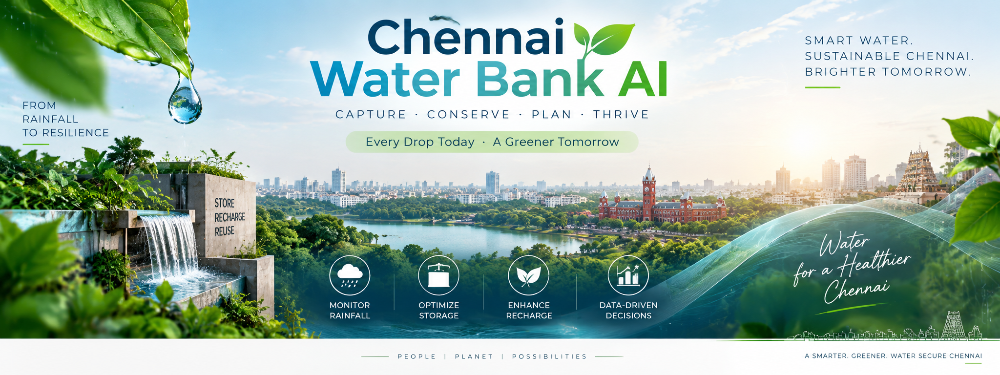
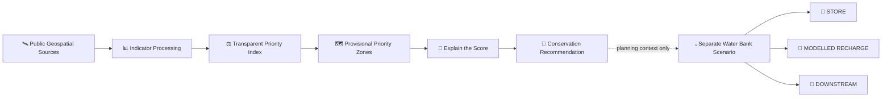
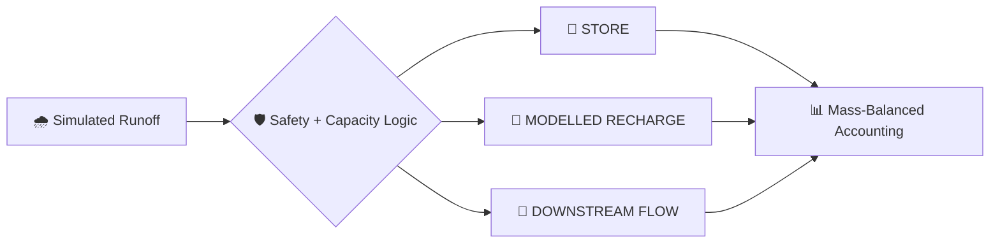
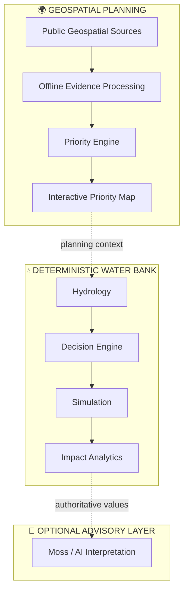

<!--
CHENNAI WATER BANK AI
GeoImpathon 1.0 | Water Resource Management | Problem Statement 2.3
Team LOGOS VICTORIS
-->

<p align="center">
  
</p>

<p align="center">
  <sub>Concept artwork · not satellite imagery or evidence of deployed infrastructure.</sub>
</p>

<h1 align="center">🌊 CHENNAI WATER BANK AI 🌊</h1>

<h3 align="center">
  Geospatial Water Conservation Priority Mapping<br />
  ×<br />
  Distributed Rainwater Intelligence
</h3>

<p align="center">
  <strong>GEOIMPATHON 1.0 — GEOSPATIAL IDEAS FOR GREENER EARTH</strong><br />
  Water Resource Management<br />
  <strong>Problem Statement 2.3 — Watershed-Based Water Resource Priority Mapping</strong>
</p>

<p align="center">
  ━━━━━━━━━━━━━━━━━━━━━━━━━━━━━━━━━━━━━━━━━━━<br />
  <strong>✦ TEAM LOGOS VICTORIS ✦</strong><br />
  <em>Map the Need · Explain the Priority · Engineer the Response</em><br />
  ━━━━━━━━━━━━━━━━━━━━━━━━━━━━━━━━━━━━━━━━━━━
</p>

<p align="center">
  
  
  
  
</p>

<p align="center">
  <a href="https://github.com/Janicebenita/CHENNAI_WATER_BANK_AI/actions/workflows/ci.yml"></a>
  
  
  
  
  
</p>

<p align="center">
  <a href="https://chennai-water-bank-geoimpathon-1032997828322.asia-south1.run.app/water_conservation_priority_map"><strong>🚀 LAUNCH GEOIMPATHON DEMO</strong></a>
  &nbsp;•&nbsp;
  <a href="#-see-it-in-action"><strong>🎬 SEE IT IN ACTION</strong></a>
  &nbsp;•&nbsp;
  <a href="#-problem-23--our-response"><strong>🎯 CHALLENGE ALIGNMENT</strong></a>
  &nbsp;•&nbsp;
  <a href="#-run-locally"><strong>💻 RUN LOCALLY</strong></a>
</p>

---

> ## 💧 Where should water-conservation intervention be investigated first?
>
> **Chennai Water Bank AI** connects source-derived geospatial evidence to an explainable conservation-priority model, then links that planning context to a **separate deterministic Water Bank simulation** for storage, modelled recharge and downstream routing.
>
> **The project is designed to answer two connected—but deliberately separate—questions:**
>
> **🌍 WHERE should conservation attention be investigated?**  
> **⚙️ WHAT could a configured Water Bank node do during a simulated event?**

<table>
<tr>
<td width="50%" valign="top">

### 🌍 GEOSPATIAL PLANNING
**WHERE?**

Open geospatial evidence  
↓  
Transparent priority index  
↓  
Provisional priority zones  
↓  
Explainable recommendation

</td>
<td width="50%" valign="top">

### 💧 WATER BANK ENGINEERING
**WHAT COULD BE EVALUATED?**

Synthetic event inputs  
↓  
Deterministic safety gates  
↓  
STORE · RECHARGE · DOWNSTREAM  
↓  
Volume-allocation impact

</td>
</tr>
</table>

> [!IMPORTANT]
> **Current evidence boundary:** 12 **demonstration analysis zones** · 8 challenge inputs supported by the model · 6 bundled source-derived indicators. **Soil and drainage density are not bundled and are not fabricated.** The current rankings are therefore **provisional**. The demonstration boundaries are **not official micro-watersheds**.

---

# ⚡ THE PROJECT IN 30 SECONDS

| ① OBSERVE | ② PRIORITIZE | ③ EXPLAIN | ④ ACT |
|---|---|---|---|
| Bring together geospatial evidence | Calculate a transparent multi-criteria score | Reveal evidence behind each zone | Connect planning to a separate Water Bank scenario |
| DEM · slope · rainfall · NDVI · land cover · surface water + supported soil/drainage inputs | Configurable weights + explicit missing-data rules | Score · class · contributions · evidence coverage | STORE → MODELLED RECHARGE → DOWNSTREAM |

<p align="center">
  <strong>GEOSPATIAL EVIDENCE → PRIORITY → EXPLANATION → RECOMMENDATION → ENGINEERING EVALUATION</strong>
</p>

---

# 🎬 SEE IT IN ACTION

<p align="center">
  <a href="https://chennai-water-bank-geoimpathon-1032997828322.asia-south1.run.app/water_conservation_priority_map">
    <strong>▶ Open the live Water Conservation Priority Map</strong>
  </a>
</p>

> **For the submission repository:** add authentic application media here when captured from the final deployed build. Do not replace this slot with a fabricated interface.

### 🗺️ Priority Map — recommended showcase asset

```html
<p align="center">
  
</p>
```

### 🔍 Selected Zone — recommended showcase asset

```html
<p align="center">
  
</p>
```

### 📊 Impact Analytics — recommended showcase asset

```html
<p align="center">
  
</p>
```

> Remove an image block if the corresponding authentic file has not been added to `Docs/` before submission.

---

# 🎯 PROBLEM 2.3 — OUR RESPONSE

### Official challenge

Identify micro-watersheds requiring water-conservation interventions using:

**DEM · Slope · Drainage Density · Rainfall · NDVI · Land Use · Soil · Surface-Water Occurrence**

Expected output:

> **Water Conservation Priority Zones**

### How the prototype addresses the challenge

| Required indicator | Model support | Bundled evidence | Current implementation |
|---|:---:|:---:|---|
| 🏔️ DEM / Elevation | ✅ | ✅ | Mapzen / Tilezen terrain |
| 📐 Slope | ✅ | ✅ | Derived from DEM |
| 🌊 Drainage Density | ✅ | ❌ | Supported through provenance-required import |
| 🌧️ Rainfall | ✅ | ✅ | NASA POWER 2024 regional reanalysis |
| 🌿 NDVI | ✅ | ✅ | Copernicus Sentinel-2 derived |
| 🏙️ Land Use / Cover | ✅ | ✅ | ESA WorldCover |
| 🪨 Soil | ✅ | ❌ | Supported through sourced HSG import |
| 💦 Surface-Water Occurrence | ✅ | ✅ | JRC / Google GSW |

<p align="center">
  <strong>8 / 8 MODEL INPUTS SUPPORTED</strong><br />
  <strong>6 / 8 BUNDLED SOURCE-DERIVED INDICATORS</strong><br />
  <strong>2 INPUTS AWAIT SOURCED EVIDENCE: SOIL + DRAINAGE DENSITY</strong><br />
  <strong>CURRENT PRIORITY STATUS: PROVISIONAL</strong>
</p>

> [!NOTE]
> **8/8 model support is not 8/8 data completeness.** Missing evidence remains missing; it is not silently estimated or zero-filled.

---

# 🛰️ FROM EARTH OBSERVATION TO CONSERVATION PRIORITY



> Operational event inputs remain synthetic. Annual rainfall and spatial priority are **never silently converted** into event rainfall, tank sizing, recharge capacity or live control signals.

---

# 🗺️ WATER CONSERVATION PRIORITY MAP

<table>
<tr>
<td width="33%" valign="top">

### 🧭 EXPLORE
Pan and zoom across georeferenced polygons.

Hover over zones.

Inspect priority classes.

</td>
<td width="33%" valign="top">

### 🔎 UNDERSTAND
Review scores and classifications.

Inspect indicator contributions.

Check effective weights and evidence.

</td>
<td width="33%" valign="top">

### 📤 EXPORT
Sort the complete results table.

Download scored CSV.

Download scored GeoJSON.

</td>
</tr>
</table>

### Priority classes

| Class | Demonstration threshold |
|---|---:|
| **Very High** | ≥ 0.80 |
| **High** | ≥ 0.60 |
| **Moderate** | ≥ 0.40 |
| **Low** | ≥ 0.20 |
| **Very Low** | < 0.20 |
| **Unranked** | Insufficient evidence |

> These are **demonstration thresholds**, not government-defined Chennai policy thresholds.

The optional CSV import requires every demonstration zone exactly once, all eight indicator columns, a source declaration and observation period. Blank values remain missing. Invalid ranges, unknown classes, duplicate zones and absent provenance are rejected. Imported declarations are labelled **user-supplied, not independently verified** and affect only the current session.

---

# 🔍 SELECT → EXPLAIN → RECOMMEND


> **A coloured polygon is not the final decision.** The interface exposes why a zone received its score and what should be investigated next.

| Priority context | Planning response |
|---|---|
| **High priority** | Investigate distributed storage, retention capacity and candidate Water Bank placement |
| **Moderate priority** | Targeted assessment and monitoring |
| **Low priority** | Monitoring; not a claim that conservation is unnecessary |
| **Water / wetland / mangrove** | Habitat-protection guidance rather than installation guidance |

> [!WARNING]
> **Recharge requires certified site testing and professional hydrogeological assessment. Field validation is required.**

---

<details>
<summary><strong>⚖️ OPEN THE PRIORITY MODEL — weights, normalization and missing-data rules</strong></summary>

## Water Conservation Priority Index

All eight starting weights are **0.125**, summing to 1.

These are **DEMONSTRATION WEIGHTS**, not government or scientifically calibrated Chennai policy weights. The application exposes the weights and rejects invalid sums.

$$
P_z = \frac{\sum_{i \in A} w_i\,n_{z,i}}{\sum_{i \in A} w_i}
$$

`A` is the same available, positively weighted indicator set across all zones.

### Missing-data safeguards

- Missing values are never zero-filled.
- At least 50% of original weight must be available.
- Bundled data supplies 75% of the original weight.
- Full-data mode requires every positively weighted indicator.
- All eight indicators must have positive weights for full-data mode to require all eight.
- Rankings created with different weight/indicator configurations should not be treated as calibrated equivalents.

### Numerical normalization

Numerical indicators use clipped `(x−min)/(max−min)`, reversed where specified.

Demonstration anchors:

- Elevation: 0–100 m — lower → higher priority
- Slope: 0–15°
- Drainage density: 0–5 km/km²
- Annual rainfall: 0–2,500 mm
- NDVI: −1 to 1 — lower → higher priority
- Surface-water occurrence: 0–100% — lower → higher priority

Higher slope, drainage density and rainfall represent **retention assessment need/opportunity in this model**, not recharge suitability.

Land-cover and soil-group scoring tables are exposed in the UI and centralized with the geospatial assumptions in `src/config/settings.py`.

Correlated indicators, mixed acquisition dates and scoring direction require sensitivity analysis and professional review.

</details>

---

# 💧 FROM PRIORITY MAPPING TO WATER BANK ENGINEERING

<h2 align="center">🏦 STORE &nbsp; → &nbsp; 🌱 RECHARGE &nbsp; → &nbsp; 🌊 DOWNSTREAM</h2>

The Water Bank is a **separate deterministic engineering layer**. Priority mapping provides planning context; it does not automatically generate infrastructure capacities or commands.



### Engineering safeguards

- Unsafe and first-flush water cannot directly recharge.
- Allocation remains capacity-constrained.
- Volumes remain nonnegative.
- Allocation remains mass-balanced.
- Existing engineering calculations remain deterministic.

The six simulated demonstration locations are **Adyar, Anna Nagar, Perungudi, T. Nagar, Tambaram and Velachery**. They are separate from the 12 geospatial analysis zones and do not represent deployed municipal assets.

---

# 📊 DEMONSTRATED SIMULATION IMPACT

<p align="center">
  <strong>SIMULATED EVENT · VOLUME-ALLOCATION RESULT</strong>
</p>

| Metric | Demonstrated simulated value |
|---|---:|
| 🌧️ Calculated runoff | **1,036,747 L** |
| 🏦 Stored locally | **279,123 L** |
| 🌱 Routed toward modelled recharge | **9,490 L** |
| 🌊 Immediate downstream flow | **748,134 L** |
| 💧 **Retained from immediate downstream flow** | **288,612 L** |
| 📉 **Simulated event runoff retained** | **≈ 27.8%** |

<h3 align="center">💧 288,612 L RETAINED FROM IMMEDIATE DOWNSTREAM FLOW</h3>
<p align="center"><strong>≈ 27.8% of this demonstrated simulated event runoff</strong></p>

> [!CAUTION]
> **This is a simulated volume-allocation result — NOT a claim of 27.8% flood reduction.**

The values above are not municipal observations, measured groundwater recharge, hydraulic flood-depth changes or flood-damage reductions. Independently rounded displayed totals can differ by one litre. The priority map does not establish these volumes as outcomes in its analysis zones.

---

# 📡 EVIDENCE, NOT A BLACK BOX

| Evidence layer | Bundled source | Key boundary |
|---|---|---|
| 🏔️ DEM | Mapzen / Tilezen | Source mosaic, not certified local survey |
| 📐 Slope | Derived from DEM | Correlated with terrain |
| 🌧️ Rainfall | NASA POWER | Regional reanalysis value shared across zones |
| 🌿 NDVI | Copernicus Sentinel-2 | Single acquisition date, not climatology |
| 🏙️ Land cover | ESA WorldCover | Not parcel-level development permission |
| 💦 Surface water | JRC / Google GSW v1.4 | Occurrence frequency, not water-area percentage |

> The repository preserves source provenance. `data/priority/manifest.json` records URLs, dates, bounding box, processing information and SHA-256 hashes.

<details>
<summary><strong>📚 OPEN FULL DATA SOURCES, PROVENANCE & PROCESSING NOTES</strong></summary>

| Official parameter | Bundled evidence | Processing / limitation |
|---|---|---|
| DEM / elevation | Mapzen/Tilezen terrain tiles, zoom 12 | Terrarium RGB decoding; mean elevation. Source mosaic, not a certified local survey. |
| Slope | Derived from the same DEM | Gradient in metres, converted to degrees; approximately 37 m terrain pixels. Correlated with terrain. |
| Drainage density | **Missing** | Accept sourced km/km² through CSV. Hydrologically conditioned drainage extraction is a next step. |
| Rainfall | NASA POWER PRECTOTCORR, 2024 | Sum of 366 daily regional reanalysis values: 1,623.87 mm. Same regional value for all zones; not a rain-gauge measurement or local rainfall gradient. |
| NDVI | Copernicus Sentinel-2B L2A, 29 February 2024, tile 44PMV | (NIR−red)/(NIR+red); honours already-applied BOA offset. SCL classes 4/5 retain cloud-free land; at least 20% valid zonal sample coverage required. One date, not climatology. |
| Land use / cover | ESA WorldCover 2021 v200 | Modal sampled land-cover class; not parcel land use or development permission. |
| Soil | **Missing** | Accept sourced hydrologic soil group A/B/C/D through CSV; do not infer from vegetation. |
| Surface-water occurrence | EC JRC/Google GSW v1.4, 1984–2021 | Mean sampled occurrence, 0–100%; excludes nodata 255. Frequency of water presence, not water-area percentage. Legacy version has provider-reported inconsistencies corrected in v1.5; upgrade/validate before decisions. |

### Source references

- [Mapzen terrain service](https://www.mapzen.com/blog/terrain-tile-service/)
- [NASA POWER Daily API](https://power.larc.nasa.gov/docs/services/api/temporal/daily/)
- [Earth Search](https://github.com/Element84/earth-search)
- [Sentinel-2 processing](https://sentiwiki.copernicus.eu/web/s2-processing)
- [ESA WorldCover](https://esa-worldcover.org/en/data-access)
- [JRC Global Surface Water](https://global-surface-water.appspot.com/download)

Cached source subsets in `data/priority/source/` retain clipped source arrays, terrain tiles, the STAC item and rainfall response.

No runtime API credentials or online analytical services are required for the bundled workflow.

The common 0.0005° grid uses nearest-neighbour samples of approximately 54 m, not exhaustive native-resolution zonal statistics.

**Study extent:** 80.10–80.28° E, 12.88–13.16° N.

### Attribution

© ESA WorldCover project 2021 / Contains modified Copernicus Sentinel data (2021) processed by ESA WorldCover consortium.

Zanaga et al. (2022), DOI: `10.5281/zenodo.7254221` — CC BY 4.0.

Sentinel-2: Copernicus/ESA via Element 84.  
Terrain: Mapzen/Tilezen and contributing sources.  
Rainfall: NASA POWER.  
Surface water: EC JRC/Google; Pekel et al. (2016), *Nature* 540, DOI: `10.1038/nature20584`.

Sources remain their providers' products; this repository adds demonstration analysis.

</details>

---

# 🛡️ RESPONSIBLE AI BY DESIGN

<h3 align="center">🤖 AI ASSISTS &nbsp; · &nbsp; ⚙️ ENGINEERING GOVERNS &nbsp; · &nbsp; 👤 HUMANS REVIEW</h3>

| 🤖 Advisory AI | ⚙️ Deterministic engineering | 👤 Human oversight |
|---|---|---|
| Interpretation assistance | Authoritative engineering values | Final judgement |
| Optional Moss layer | Safety and capacity gates | Field validation |
| No infrastructure command authority | Mass-balanced allocation | Professional review |

The Water Conservation Priority Map makes **no AI calls** and runs without Moss credentials. Moss remains optional and disabled by default. Advisory output cannot command infrastructure.

---

# 🔌 PHYSICAL PROOF OF CONCEPT

The separate ESP32 device explores how future Water Bank infrastructure could connect sensing and edge control.

<p align="center">
  <strong>ESP32 PHYSICAL PROOF-OF-CONCEPT · CURRENTLY OFFLINE · NOT A LIVE CHENNAI DEPLOYMENT</strong>
</p>

[Open the separate prototype interface](https://chennai-water-bank-prototype-1032997828322.asia-south1.run.app/prototype_node)

---

# 🏗️ SYSTEM ARCHITECTURE



<details>
<summary><strong>🧑‍💻 OPEN REPOSITORY ARCHITECTURE</strong></summary>

```text
app.py / pages/                              Streamlit entry and navigation
pages/00_water_conservation_priority_map.py  Problem 2.3 priority page
src/geospatial/priority.py                   Normalization, scoring, classification, recommendation
src/geospatial/data.py                       Offline evidence and validated CSV import
src/config/settings.py                       Central geospatial assumptions + engine settings
scripts/build_priority_sample.py             Optional reproducible source preprocessing
data/priority/                               GeoJSON, provenance and source subsets
src/decision/ + src/hydrology/               Deterministic engineering core
src/simulation/ + src/impact/                Synthetic scenarios and volume accounting
src/agents/ + src/memory/                    Optional advisory layer
```

</details>

---

# 🔬 WHAT THIS PROTOTYPE DOES — AND DOES NOT CLAIM

| ✅ WHAT IS DEMONSTRATED | ❌ WHAT IS NOT CLAIMED |
|---|---|
| Screens demonstration analysis zones | Official micro-watershed delineation |
| Combines source-derived spatial indicators | Scientifically calibrated Chennai policy weights |
| Supports all eight challenge inputs | Complete bundled evidence for all eight |
| Explains priority contributions | Certified recharge suitability |
| Produces planning recommendations | Infrastructure approval |
| Evaluates synthetic Water Bank scenarios | Live Chennai network operation |
| Accounts for simulated volumes | Hydraulic flood-depth prediction |
| Provides optional AI interpretation | Autonomous infrastructure control |

> **Transparency is a feature of the solution.** Missing evidence, simulation boundaries and validation requirements are exposed rather than hidden.

---

<details>
<summary><strong>🔎 OPEN LIMITATIONS & NEXT VALIDATION STEPS</strong></summary>

- The 12 bundled polygons are demonstration rectangles, not official micro-watersheds.
- DEM conditioning, catchment delineation and boundary validation remain outstanding.
- Soil and drainage density are missing from the bundled sample.
- Six-input rankings are provisional; sourced missing evidence is required for the complete supported model.
- Acquisition periods are mixed.
- NDVI is based on a single date.
- Regional rainfall is shared across zones.
- Terrain resolution and sampled zonal aggregation are limited.
- JRC GSW v1.4 carries a legacy provider caveat; corrected/validated data should be used before field decisions.
- Weights, normalization anchors and class thresholds are demonstration assumptions and remain uncalibrated.
- Priority is not intervention effectiveness or recharge permission.
- There is no live physical sensing or autonomous infrastructure control.
- There is no calibrated hydraulic flood-depth or flood-damage model.
- External context tiles require internet; scoring, tables, recommendations and polygon geometry do not.

</details>

---

# ✅ ENGINEERING VALIDATION

| Check | Verified adaptation baseline |
|---|---:|
| 🧪 Tests | **103 passed** |
| 📈 Coverage | **95.30%** |
| 🐍 Python | **3.12.14** |
| 🧹 Ruff | **Passed** |
| 🧱 compileall | **Passed** |
| ⚙️ GitHub CI | **Passed at verified revision** |

Verified baseline commit: [`03f83ea`](https://github.com/Janicebenita/CHENNAI_WATER_BANK_AI/commit/03f83ea2d96a6b032c9d4fffee1907318157e694)

> Static test and coverage badges above record this verified adaptation baseline; the CI badge reflects the latest workflow state.

---

# 🚀 RUN LOCALLY

### Windows PowerShell

```powershell
python -m venv .venv
.venv\Scripts\Activate.ps1
python -m pip install -r requirements.txt

$env:DATA_BACKEND="memory"
$env:MOSS_ENABLED="false"

python -m streamlit run app.py
```

### Validation

```powershell
python -m pytest
python -m ruff check .
python -m compileall -q app.py pages src tests scripts
```

### Optional geospatial preparation

```powershell
python -m pip install rasterio Pillow
python scripts/build_priority_sample.py
```

The preprocessing script reuses cached subsets and performs no credentialed access. It does not run at application startup. If public source data is regenerated, verify hashes and source/version notes after refresh.

---

# 📂 QUICK REPOSITORY GUIDE

| Path | Purpose |
|---|---|
| `pages/00_water_conservation_priority_map.py` | Problem 2.3 interactive map |
| `src/geospatial/priority.py` | Normalization, scoring and classification |
| `src/geospatial/data.py` | Evidence loading and validated import |
| `src/config/settings.py` | Geospatial assumptions and configuration |
| `data/priority/` | Priority data, provenance and source subsets |
| `scripts/build_priority_sample.py` | Reproducible source preprocessing |
| `src/hydrology/` | Deterministic hydrology |
| `src/decision/` | Engineering decision logic |
| `src/simulation/` | Synthetic scenario simulation |
| `src/impact/` | Volume accounting |
| `src/agents/` | Optional advisory layer |

---

# ✦ TEAM LOGOS VICTORIS ✦

<p align="center">
  ╔══════════════════════════════════════════════════════╗<br />
  <strong>⚜️ LOGOS VICTORIS ⚜️</strong><br />
  <em>Evidence · Engineering · Explainability · Action</em><br />
  ╚══════════════════════════════════════════════════════╝
</p>

<table align="center">
<tr>
  <th>Role</th>
  <th>Team Member</th>
</tr>
<tr>
  <td><strong>Team Lead</strong></td>
  <td><strong><a href="https://github.com/Janicebenita">Janice Benita F</a></strong></td>
</tr>
<tr>
  <td><strong>Team Member</strong></td>
  <td><strong>Tytus Glaston</strong></td>
</tr>
</table>

<p align="center">
  Built for <strong>GeoImpathon 1.0 — Geospatial Ideas for Greener Earth</strong><br />
  Water Resource Management · Problem Statement 2.3
</p>

---

<p align="center">
  <a href="https://chennai-water-bank-geoimpathon-1032997828322.asia-south1.run.app/water_conservation_priority_map"><strong>🚀 LIVE GEOIMPATHON DEMO</strong></a>
  &nbsp;•&nbsp;
  <a href="https://github.com/Janicebenita/CHENNAI_WATER_BANK_AI"><strong>📦 SUBMISSION REPOSITORY</strong></a>
</p>

<h2 align="center">🌧️ MAP → PRIORITIZE → CONSERVE → ACT 💧</h2>

<h3 align="center">
  Bank the Rain. Reduce Immediate Runoff.<br />
  Build Urban Water Resilience.
</h3>

<p align="center">
  <strong>CHENNAI WATER BANK AI</strong><br />
  <strong>✦ TEAM LOGOS VICTORIS ✦</strong><br />
  <em>Geospatial Water Conservation Priority Mapping &amp; Distributed Rainwater Intelligence</em>
</p>
